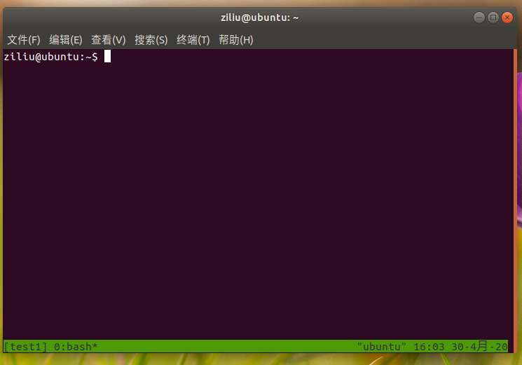
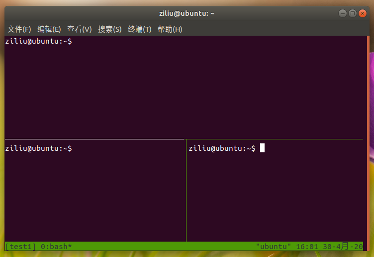

# Ubuntu终端会话与窗口管理——tmux的使用

> 有时我们需要在Ubuntu上运行一些服务类程序，但是这些程序在关闭终端后就会结束，例如Jupyter notebook；利用nohup推送到后台，服务就无法正常工作，例如Minecraft的服务端，这时我们可以使用tmux进行终端的会话与终端管理，完美解决这个问题。

<span style="display:block;text-align:right;color: #ffb11b;">这是我的第2篇原创文章，该篇约3318字，总阅读时长约10分钟。</span>

## 懒人目录

零、前言

一、安装与基本使用

二、会话管理

三、窗口管理

四、其他一些命令

五、参考链接

## 零、前言

正如文章开头的介绍所说，我们在Ubuntu上运行一些服务类别程序时，有时无法保证程序一直正常运行而不被打断，比如当我们使用SSH远程服务器时，如果网络突然中断或者我们把SSH终端关闭，那将会直接杀死服务。这里就要说明一下终端和进程的关系。

命令行的典型使用方式是，打开一个终端窗口（terminal window，以下简称"终端"），在里面输入命令。用户与计算机的这种临时的交互，称为一次"会话"（session） 。会话的一个重要特点是，窗口与其中启动的进程是绑定的关系，打开终端，会话开始；关闭终端，会话结束，会话内部的进程也会随之终止，不管有没有运行完。所以当我们使用SSH进行远程链接操作指令时，如果关闭了SSH终端或者网络异常，那么会话也就会终止，程序自然也就会被杀死。

为了解决这个问题，我们可以使用tmux这个工具，这个工具的好处就是它会创建独立的会话，而不依赖于也不绑定某个终端，任何一个终端都可以将它调起，终端终止，也不影响tmux创建的会话。这对运行服务十分有用。

#### tmux具有以下优点：

- 它允许在单个终端中，同时访问多个会话。这对于同时运行多个命令行程序很有用。
- 它可以让新终端“接入”已经存在的会话。
- 它允许每个会话有多个连接终端，因此可以多人实时共享会话。
- 它还支持窗口任意的垂直和水平拆分。

#### 相关名词解释（指在tmux而言）：

**终端**（Terminal）：一个终端可以理解为我们在ubuntu上打开的一个命令行窗口，或者通过SSH打开的一个窗口；（可以这样理解，虽然这样解释不是很对）

**会话**（Session）：用户与计算机的这种临时的交互，称为一次"会话"（session） ；

**窗口**（Window）：在会话下的一个容器，一个会话下可以有多个窗口，即多个容器，我们可以在每个容器上做不同的事情，每个窗口是独立的，互不影响；

**窗格**（Pane）：在一个窗口中可以分成几个小的区域，这每一个区域是一个窗格，窗格是摆放在窗口中的。

tmux中的逻辑是这样的：我们在一个终端可以创建几个tmux会话，在一个会话中可以创建若干个窗口，这若干个窗口都是自己干自己的活，互相不打扰，在某一个窗口中，我们还可以创建若干个窗口，这些窗口可以左右摆放，也可以上下摆放，就看你心情了。

**前缀键**：Tmux 窗口有大量的快捷键。所有快捷键都要通过前缀键唤起。默认的前缀键是`Ctrl+b`，即先按下`Ctrl+b`，快捷键才会生效。举个栗子，帮助命令的快捷键是`Ctrl+b ?`。它的用法是，在 Tmux 窗口中，先按下`Ctrl+b`，然后两个按键都松开，再轻点`?`，就会显示帮助信息。然后，按下 ESC 键或`q`键，就可以退出帮助啦。

接下来就进入正题。

## 一、安装与基本使用

Tmux的安装方法如下：

```shell
# Ubuntu或Debian
$ sudo apt install tmux
# CentOS或Fedora
$ sudo yum install tmux
# Mac
$ brew install tmux
```

安装完成后，在终端中键入`tmux`，就进入tmux窗口啦。tmux的窗口长这个样子：



左下方的方括号表示的是当前会话名称，`0:bash*`表示现在有一个0号窗口，使用的是bash，星号表示的是该窗口为当前窗口，右下方则是一些系统信息啦。

退出也很简单，只要在窗口上按下`Ctrl+D`快捷键，或者在窗口中输入`exit`，就可以结束当前的会话了。

## 二、会话管理

#### 1、新建会话

默认情况下，新建一个会话是按照序号排序的，比如刚刚我们新建的会话是0，那么再创建就是1了，以此类推。但是这样用起来不直观，我们可以给每个会话进行命名，命令如下：

```shell
# 新建会话，会按照序号起名，这样不直观
$ tmux
# 新建会话，并且给会话起个名字，例如tmux new -s test1
$ tmux new -s <session-name>
```

#### 2、分离会话

在Tmux窗口中，按下`Ctrl+B D`或者输入`tmux detach`命令，就可以将终端与当前会话分离开来，但是会话和在会话中运行的程序还会继续在后台运行，除非你杀死了会话或者你重启电脑。

#### 3、会话列表

在命令行中输入`tmux ls`或者输入`tmux list-session`就会列出所有的会话，我们可以根据提示信息来接入会话或者杀死会话。

#### 4、接入会话

我们可以使用tmux attach命令来重新接入已存在的会话：

```shell
# 先看看都有什么会话
$ tmux ls
# 1: 1 windows (created Thu Apr 30 16:01:15 2020) [80x23]
# test1-2: 1 windows (created Thu Apr 30 16:04:42 2020) [80x23] (group test1)
# 接入的命令为
$ tmux attach -t <num or session-name>
# 如果想接入第一个就输入
$ tmux attach -t 1
# 如果想接入第二个就输入
$ tmux attach -t test1
```

**注意**：当会话只有编号的时候，只能使用`0、1、2`这样的编号来接入、杀死或者做其他的事情（下面会讲），当会话有名字的时候，需要使用名字，编号是无法使用的。

#### 5、杀死会话

杀死会话的方法有很多，在会话中，我们可以使用快捷键Ctrl+D（注意，这个不需要前缀键）或者输入`exit`，就可以杀死会话。

此外也可以使用`tmux kill-session`命令来杀死指定的会话，使用方法同接入会话：

```shell
# 使用会话编号或者名称
$ tmux kill-session -t <num or session-name>
```

#### 6、切换会话

切换会话的命令为`tmux switch`，使用方法同上：

```shell
# 使用会话编号或名称切换会话
$ tmux switch -t <num or session-name>
```

#### 7、重命名会话

重命名会话的命令为`tmux rename-session`，使用方法类似于上面：

```shell
 $ tmux rename-session -t <num or old session-name> <new-name>
 # 举个栗子
 # 将编号为1的会话改为test
 $ tmux rename-session -t 1 test
 # 将test1改为test11
 $ tmux rename-session -t test1 test11
```

#### 8、会话相关的快捷键

- `Ctrl+B D`：分离当前会话。
- `Ctrl+B S`：列出所有会话（后面会详细说）。
- `Ctrl+B $`：重命名当前会话。
- `Ctrl+D`：杀死会话。
- `Ctrl+B ?`：快捷键帮助。

## 三、窗口管理

在Tmux中，一个会话中可以创建多个窗口。

#### 1、新建窗口

新建窗口的快捷键是`Ctrl+B C`，命令为`tmux new-window`，使用方法和上面会话管理是类似的：

```shell
# 新建一个窗口，按照序号排列
$ tmux new-window
# 新建一个指定名称的窗口（注意参数有点不同）
$ tmux new-window -n <window-name>
```

#### 2、窗口列表

在命令行中输入`tmux lsw`或者输入`tmux list-windows`就会列出当前会话的所有窗口，我们可以根据提示的序号或者名称来切换窗口或者杀死会话。

#### 3、切换窗口

可以使用快捷键`Ctrl+B P`来切换到上一个窗口，也可以使用快捷键`trl+B N`切换到下一个窗口，也可以使用命令`tmux select-window`来切换窗口，使用方法同其他命令：

```shell
# 切换到指定编号或者制定名称的窗口
$ tmux select-window -t <window-number or window-name>
```

#### 4、重命名窗口

可以使用tmux rename-window命令来给当前的窗口起名或者重命名。

```shell
# 为当前的窗口重命名
$ tmux rename-window <new-name>
```

#### 5、删除窗口

删除窗口的快捷键为`Ctrl+B &`，命令为`tmux kill-window`：

```shell
# 删除当前的窗口
$ tmux kill-window
#删除指定序号或名称的敞口
$ tmux kill-window -t <window-number or window-name>
```

#### 6、窗口相关快捷键

- `Ctrl+b c`：创建一个新窗口，状态栏会显示多个窗口的信息。
- `Ctrl+b p`：切换到上一个窗口（按照状态栏上的顺序）。
- `Ctrl+b n`：切换到下一个窗口。
- `Ctrl+b <number>`：切换到指定编号的窗口，其中的`<number>`是状态栏上的窗口编号。
- `Ctrl+b w`：从列表中选择窗口。
- `Ctrl+b ,`：窗口重命名。
- `Ctrl+B &`：删除窗口。

#### 四、窗格管理

窗格是tmux的一大亮点，我们可以在其中做很多事情，比如如下图：



下面对窗格做一下简单的介绍。

#### 1、划分窗格

可以使用命令`mux split-window`进行划分窗格，当然也可以使用快捷键，快捷键见后面的小节：

```shell
# 划分上下两个窗格
$ tmux split-window
# 划分左右两个窗格
$ tmux split-window -h
```

#### 2、移动光标

移动光标可以使用快捷键进行操作，快捷键见后面的小节，命令为`tmux select-pane`：

```shell
# 光标切换到上方窗格
$ tmux select-pane -U
# 光标切换到下方窗格
$ tmux select-pane -D
# 光标切换到左边窗格
$ tmux select-pane -L
# 光标切换到右边窗格
$ tmux select-pane -R
```

#### 3、窗格列表

窗格也可以通过列表来查看，命令为`tmux lsp`或者`tmux list-pane`。

#### 4、关闭窗格

关闭窗格可以使用快捷键关闭当前的窗格，也可以使用`tmux kill-pane`命令来关闭窗格，用法同会话和窗口：

```shell
# 删除当前的窗格
$ tmux kill-pane
#删除指定序号的窗格
$ tmux kill-pane -t <pane-num>
```

#### 5、交换窗格位置

可以使用快捷键，也可以使用命令`tmux swap-pane`来操作：

```shell
# 当前窗格上移
$ tmux swap-pane -U
# 当前窗格下移
$ tmux swap-pane -D
```

#### 6、`Ctrl+B S`和`Ctrl+B W`说明

这两个快捷键可以分别列出所有的会话和当前会话的所有窗口，其中`Ctrl+B S`为列出所有会话，会话是以树状形式展现的，按上下键可以选择会话，按左右键可以展开和折叠树状图，会话下可以看到窗口，窗口下可以看到窗格，选中后回车就可以切换到选择的会话、窗口或者窗格。`Ctrl+B W`道理也是一样的，只不过父元素不是会话，而是窗口了。

#### 7、窗格快捷键

- `Ctrl+b %`：划分左右两个窗格。
- `Ctrl+b "`：划分上下两个窗格。
- `Ctrl+b <arrow key>`：光标切换到其他窗格。`<arrow key>`是指向要切换到的窗格的方向键，比如切换到下方窗格，就按方向键`↓`。
- `Ctrl+b ;`：光标切换到上一个窗格。
- `Ctrl+b o`：光标切换到下一个窗格。
- `Ctrl+b {`：当前窗格左移。
- `Ctrl+b }`：当前窗格右移。
- `Ctrl+b Ctrl+o`：当前窗格上移。
- `Ctrl+b Alt+o`：当前窗格下移。
- `Ctrl+b x`：关闭当前窗格。
- `Ctrl+b !`：将当前窗格拆分为一个独立窗口。
- `Ctrl+b z`：当前窗格全屏显示，再使用一次会变回原来大小。
- `Ctrl+b Ctrl+<arrow key>`：按箭头方向调整窗格大小。
- `Ctrl+b q`：显示窗格编号。

## 四、其他一些命令

```shell
# 列出所有快捷键，及其对应的 Tmux 命令
$ tmux list-keys

# 列出所有 Tmux 命令及其参数
$ tmux list-commands

# 列出当前所有 Tmux 会话的信息
$ tmux info

# 重新加载当前的 Tmux 配置
$ tmux source-file ~/.tmux.conf
```

## 五、参考链接

http://www.ruanyifeng.com/blog/2019/10/tmux.html

https://www.cnblogs.com/maoxiaolv/p/5526602.html

<span style="display:block;text-align:right;color: #ffb11b;">沉迷学习，点亮在看！</span>

